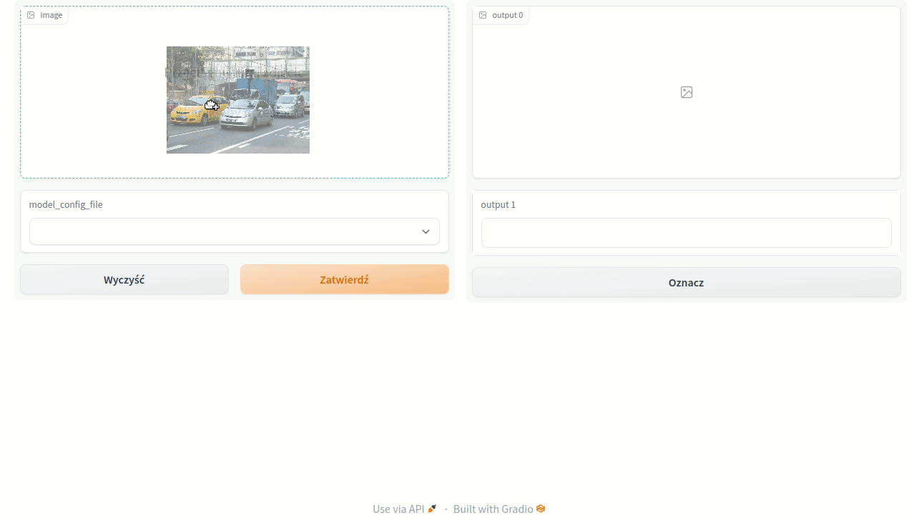

# Car detection

Car detection app using pretrained model.

## Docker

Create Docker image:
```shell
docker build --rm . -t e-dzia/detectron2:latest
```

## Notebook server

To run the notebook server run the Docker container with changed entrypoint:
```shell
docker run --entrypoint jupyter -it -p 8888:8888 e-dzia/detectron2:latest notebook --ip 0.0.0.0 --no-browser --allow-root
```

The notebook server will be available at `http://localhost:8888/`.

## Gradio app

To run the demo application with Detectron2 model usage, the Docker container must be run with additional arguments:
```shell
docker run -it -p 7860:7860 e-dzia/detectron2:latest
```

The app will open on the `http://localhost:7860/`.
It allows choosing from several models and drag&dropping images for prediction.
The result is the image with bounding boxes drawn on top of it and an information about the number of found cars.



### Share your app

To share your app, you need to specify login and password during Docker run:
```shell
docker run -it -p 7860:7860 e-dzia/detectron2:latest --share --login mylogin --passwd mypasswd1234
```

The defaults are admin:admin.

In the console, you would see the link to share the app: "Running on public URL".
You can share it and all computations will be performed on your machine.

# Tests

Run tests:
```shell
docker run --entrypoint "python" e-dzia/detectron2:latest tests/test_detectron2_model.py
```
